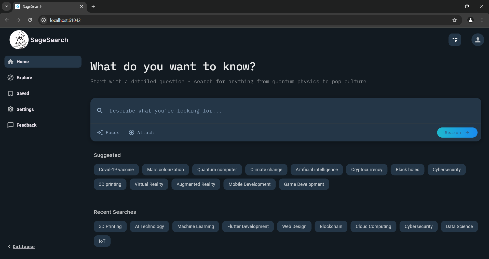
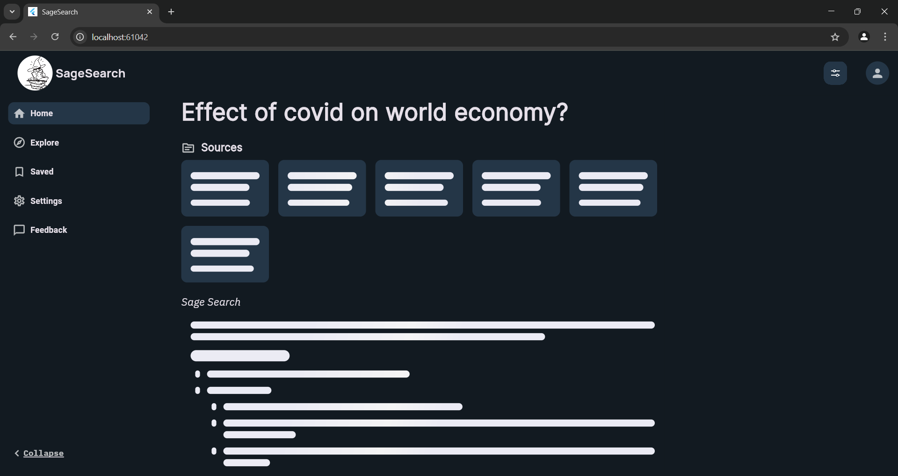
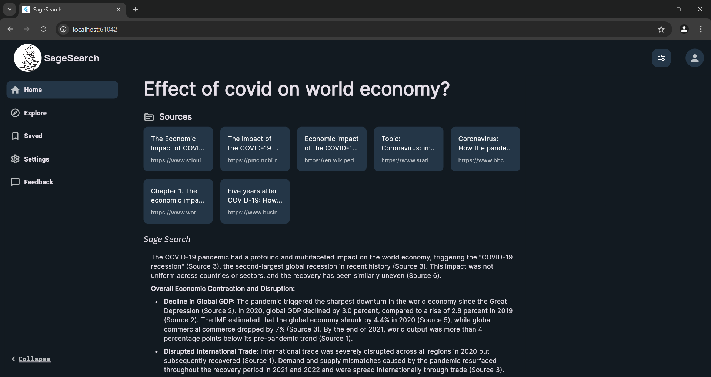

<div align="center">
  
  <h1>SageSearch</h1>
  <p><strong>Intelligent web search and information synthesis platform</strong></p>
  
  <p>
    <a href="#features">Features</a> •
    <a href="#demo">Demo</a> •
    <a href="#installation">Installation</a> •
    <a href="#usage">Usage</a> •
    <a href="#architecture">Architecture</a> •
    <a href="#contributing">Contributing</a> •
    <a href="#license">License</a>
  </p>
  
  <p>
    
    
    
    
  </p>
</div>

## 📋 Overview

SageSearch is a sophisticated search platform built with Flutter and FastAPI that transforms how users discover information online. It intelligently retrieves, analyzes, and synthesizes content from multiple web sources, delivering comprehensive AI-enhanced responses to user queries while maintaining source attribution.

<div align="center">
  <!-- Consider adding a screenshot here -->
  <p><em>SageSearch in action - Intelligent search results with source attribution</em></p>
</div>

## ✨ Features

### Frontend
- 🎯 **Intuitive Interface** - Clean, modern UI with focus on content and readability
- 📱 **Fully Responsive** - Seamless experience across desktop, tablet, and mobile devices
- 💡 **Smart Suggestions** - Contextual search suggestions and history tracking
- 🎨 **Customizable Theme** - Dark mode support with elegant color scheme
- ⚡ **Performance Optimized** - Fast loading times and smooth animations

### Backend
- 🔍 **Intelligent Web Search** - Leverages Tavily API for accurate and relevant search results
- 🧠 **Smart Source Ranking** - Uses sentence transformers to prioritize the most relevant sources
- 🤖 **AI-Powered Responses** - Generates comprehensive answers using Google Gemini
- 🔄 **Real-time Communication** - WebSocket support for streaming responses
- 🌐 **RESTful API** - Clean and well-documented endpoints for easy integration

## 🎬 Demo

<div align="center">
  <h3>Home Page</h3>
  
  
  <h3>Loading Page</h3>
  
  
  <h3>Result Page</h3>
  
</div>


## 🚀 Getting Started

### Prerequisites

#### Frontend
- Flutter SDK (latest version)
- Dart SDK (latest version)
- A code editor (VS Code, Android Studio, or IntelliJ IDEA)

#### Backend
- Python 3.8+
- [Tavily API key](https://tavily.com/) - For web search capabilities
- [Google Gemini API key](https://ai.google.dev/) - For AI response generation

### Installation

#### Frontend

1. **Clone the repository**
   ```bash
   git clone https://github.com/AyushKr2003/sage_search.git
   cd sage_search
   ```

2. **Install dependencies**
   ```bash
   cd frontend
   flutter pub get
   ```

3. **Environment Setup**
   
   Create a `.env` file in the frontend directory based on the provided example:
   ```bash
   copy .env.example .env
   ```
   
   Then update the values in `.env` with your configuration:
   ```
   BACKEND_URL='ws://localhost:8000/ws/chats'
   ```

4. **Run the application**
   ```bash
   flutter run
   ```

#### Backend

1. **Navigate to the backend directory**
   ```bash
   cd backend
   ```

2. **Set up the environment**
   ```bash
   # Create and activate virtual environment
   python -m venv venv
   .\venv\Scripts\activate

   # Install dependencies
   pip install -r requirements.txt

   # Configure environment variables
   copy .env.example .env
   ```

   Edit the `.env` file with your API keys:
   ```
   TAVILY_API_KEY=your_tavily_api_key
   GEMINI_API_KEY=your_gemini_api_key
   ```

3. **Run the server**
   ```bash
   # Development mode with auto-reload
   uvicorn main:app --reload

   # Production mode
   uvicorn main:app --host 0.0.0.0 --port 8000
   ```

   The server will be available at `http://localhost:8000`

## 📖 Usage

SageSearch provides an intuitive interface for searching and discovering information:

1. Enter your query in the search bar
2. Review the AI-synthesized answer with highlighted sources
3. Explore related topics through suggested searches
4. Toggle between light and dark themes based on your preference

## 🏗️ Architecture

### Project Structure

```
sage_search/

├── lib/
│   ├── constant/
│   │   └── const.dart               # Application constants and configuration
│   ├── pages/ 
│   │   └── home_page.dart           # Main application interface
│   ├── theme/ 
│   │   └── colors.dart              # Theme definitions and styling
│   ├── widgets/     
│   │   ├── custome_list.dart        # Reusable list component
│   │   ├── search_section.dart      # Search interface component
│   │   ├── side_bar.dart            # Navigation sidebar
│   │   ├── side_bar_button.dart     # Interactive sidebar elements
│   │   └── top_bar.dart             # Application header component
│   ├── services/                    
│   │   └── web_socket_service.dart  # API and data services
│   └──  main.dart                   # Application entry point
│
├── server/
│   ├── main.py                      # FastAPI application and endpoints
│   ├── config.py                    # Configuration settings
│   ├── services/
│   │   ├── search_service.py        # Tavily API integration
│   │   ├── sort_sorce_service.py    # Source ranking
│   │   └── llm_service.py           # Gemini AI integration
│   ├── pydantic_model/
│   │   └── chat_body.py             # Request/Response models
│   ├── tests/                       # Unit and integration tests
│   └── requirements.txt             # Project dependencies
```

### API Reference

#### REST Endpoints

```
POST /chats
```

Request body:
```json
{
  "query": "What are the latest developments in quantum computing?"
}
```

#### WebSocket

Connect to `/ws/chats` to receive streaming responses.

Example client usage:
```javascript
const ws = new WebSocket('ws://localhost:8000/ws/chats');
ws.onopen = () => {
  ws.send(JSON.stringify({ query: "What are the latest developments in quantum computing?" }));
};
ws.onmessage = (event) => {
  const data = JSON.parse(event.data);
  console.log(data);
};
```

## 🤝 Contributing

Contributions are what make the open-source community such an amazing place to learn, inspire, and create. Any contributions you make are **greatly appreciated**.

1. Fork the Project
2. Create your Feature Branch (`git checkout -b feature/amazing-feature`)
3. Commit your Changes (`git commit -m 'Add some amazing feature'`)
4. Push to the Branch (`git push origin feature/amazing-feature`)
5. Open a Pull Request

See the [open issues](https://github.com/AyushKr2003/sage_search/issues) for a list of proposed features and known issues.

## 📄 License

This project is licensed under the MIT License - see the [LICENSE](LICENSE) file for details.

## 👏 Acknowledgments

### Frontend
- [Flutter](https://flutter.dev/) - UI toolkit for building natively compiled applications
- [Google Fonts](https://fonts.google.com/) - Beautiful typography
- [Material Design](https://material.io/) - Design system and components

### Backend
- [Tavily API](https://tavily.com/) - For search capabilities
- [Google Gemini](https://ai.google.dev/) - For AI response generation
- [FastAPI](https://fastapi.tiangolo.com/) - For the web framework
- [Sentence Transformers](https://www.sbert.net/) - For source ranking

### Team
- All [contributors](https://github.com/AyushKr2003/sage_search/graphs/contributors) who have helped shape SageSearch

---

<div align="center">
  <sub>Built with ❤️ by <a href="https://github.com/AyushKr2003">Ayush Kumar Singh</a></sub>
</div>
